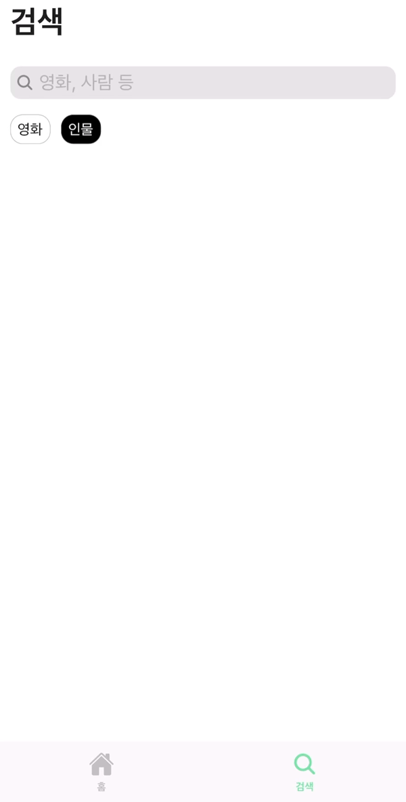

<!-- # 🎬영화앱

## 📚사용 스택

# 🔗API

[TMDB API](https://developer.themoviedb.org/docs/getting-started)

## 💡기능들

### Home Screen

지금 상영중, 인기 영화, 평점순, 인기 배우 추천.

영화: 포스터, 제목, 평점 등 기본 정보 표시

배우: 인물 사진, 이름 표시

### Search Screen

영화, 인물 검색 기능.

Infinite Scroll 기능 지원.

### Movie Detail Screen

#### 영화 기본 정보

- 포스터/백드롭 이미지
- 영화 제목/원제
- 개봉일/러닝 타임
- 감독
- 평점
- 장르

#### 영화 개요/캐치프레이즈

#### 영화 출연진

#### 영화 티저/트레일러

- [React Native Youtube-iframe](https://lonelycpp.github.io/react-native-youtube-iframe/)을 이용한 동영상 임베드

#### 제작사

#### 영화 추천

- 비슷한 영화들을 추천

### Person Detail Screen

#### 인물 기본 정보

- 전문 분야
- 성별
- 생일
- 출생지

#### 인물 약력

#### 출연작/제작 정보

### Dark Mode

### 그 외 기능들

- 네비게이션 ([React Navigation](https://reactnavigation.org/))
- 데이터 캐싱 ([TanStack Query](https://tanstack.com/query/latest/docs/framework/react/overview)) -->

# 🎬 영화 앱

React Native와 TypeScript로 제작된 모바일 애플리케이션으로, TMDB API를 이용해 영화, 배우 및 관련 정보를 제공합니다.

## 📚 기술 스택

   

## 🔗 API

이 앱은 [TMDB API](https://developer.themoviedb.org/docs/getting-started)를 사용해 영화와 배우 데이터를 가져옵니다.

## 💡 기능들

### 🏠 홈 화면

- **현재 상영 중인 영화**, **인기 영화**, **평점 높은 영화**, **인기 배우** 추천.
- 영화 포스터, 제목, 평점 및 배우 사진과 이름을 표시합니다.

  

### 🔍 검색 화면

- 영화와 배우를 검색할 수 있습니다.
- 무한 스크롤 기능을 지원합니다.

  

### 🎥 영화 상세 화면

- **기본 정보**: 포스터, 제목, 원제, 개봉일, 러닝 타임, 감독, 평점, 장르.
- **영화 개요 및 캐치프레이즈**
- **출연진**
- **티저/트레일러**: [React Native Youtube-iframe](https://lonelycpp.github.io/react-native-youtube-iframe/)을 사용해 임베드.
- **제작사**
- **추천 영화**: 비슷한 영화 추천.

  

### 🎭 인물 상세 화면

- **기본 정보**: 전문 분야, 성별, 생일, 출생지.
- **약력**
- **출연작/제작 정보**

  

### 🌑 다크 모드

  

### ⚙️ 추가 기능들

- **네비게이션**: [React Navigation](https://reactnavigation.org/) 사용.
- **데이터 캐싱**: [TanStack Query](https://tanstack.com/query/latest/docs/framework/react/overview)로 처리.

---
